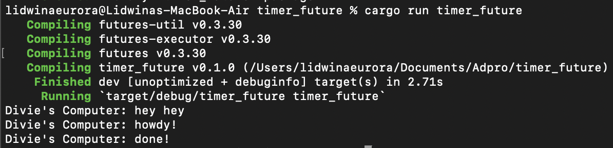

# Advance Programming Tutorial 10
Tutorial for Advanced Programming 2024 Module 10 - Faculty of Computer Science, Universitas Indonesia

---
## Reflection - Timer Future

---

### 1.2. Understanding How It Works

Dalam kode Rust ini, Rust mengimplementasi executor sederhana untuk menjalankan task-task asynchronous. Struktur data yang dimaanfaatkan contohnya `Task`, `Spawner`, dan `Executor` dengan memanfaatkan komunikasi antara spawner dan executor. Urutan output yang dihasilkan adalah "hey hey", "howdy!", dan kemudian "done!" yang dipengaruhi oleh executor yang menjalankan task asynchronous.

Output pertama yaitu "hey hey" dicetak pertama kali karena ada di dalam block `main()` yang dieksekusi sebelum task asynchronous. Kemudian task asynchronous "howdy!" dieksekusi, dan sebelum eksekusinya selesai "done!" belum dapat dihasilkan. Executor akan menunggu dengan `TimerFuture` (dalam kode ini 2 detik) sampai task asynchronous selesai baru kemudian mencetak "done!".